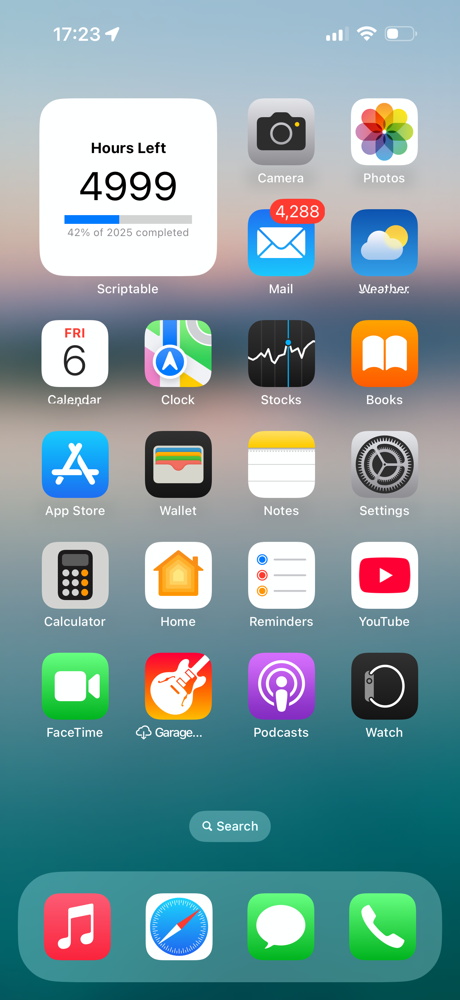

# 📆 Remaining Hours in 2025 — Scriptable Widget

> A clean iOS widget built with **Scriptable** that shows how many hours are left in 2025 and visualizes your year-to-date progress with a sleek progress bar.

---

## ✨ Features
- **Live countdown** – updates every minute.
- **Compact progress bar** – instantly shows how far you’ve come through 2025.
- **Auto-adapt** – handles dates before 2025 starts and after it ends.
- **Small-size widget** – perfect for stacking or placing anywhere on your Home Screen.

---

## 📸 Preview  

---

## 🚀 Quick Start

1. **Install [Scriptable](https://apps.apple.com/app/scriptable/id1405459188)** from the App Store.  
2. Open Scriptable ➜ tap **+** ➜ paste the code from `Yearly-Progress-IOS-Widget.js` and save.
3. Long-press your Home Screen ➜ **+** ➜ choose **Scriptable** ➜ add a **Small** widget.
4. Edit the widget ➜ set **Script** to **Yearly-Progress-IOS-Widget** ➜ done!

The widget will refresh itself every minute to keep the countdown accurate.

---

## 🛠️ Customization Tips
| What | How |
|------|-----|
| 🎨 Progress-bar colors | Change the two `Color("#...")` values in the script. |
| 🔄 Refresh interval   | Adjust `1000 * 60` (milliseconds) to another period. |
| 📏 Widget size        | The script is optimized for **Small**; tweak fonts for Medium/Large. |

---

## 📄 License
[MIT](LICENSE) – free for personal & commercial use. Enjoy!
